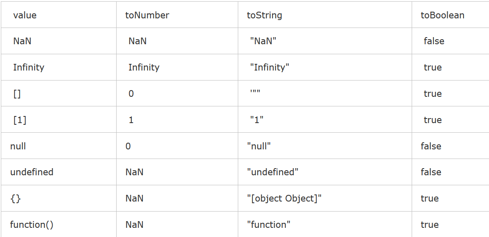

### 1 数组去重

```js
    // 思路1：定义一个新数组，并存放原数组的第一个元素，
    // 然后将元素组一一和新数组的元素对比，若不同则存放在新数组中。
    function unique(arr) {
      var res = [arr[0]];
      for (var i = 0;i < arr.length;i++) {
        var repeat = false;
        for (var j = 0;j<res.length;j++) {
          if (arr[i] === res[j]) {
            repeat = true;
            break;           
            alert(1);                        
          }
        }
        if (!repeat) {
          res.push(arr[i]);
        }
      }
      return res;
    }
    console.log(unique([1,2,1,2,3,4,3,1,3,4]));

```

### 2 使用正则表达式验证邮箱格式
### 3 计算数组arr所有元素的和
```js
  var arr = [1,2,3];
  var sum = 0;
  for (var i = 0;i <= arr.length;i++){
    sum += i
  }
  console.log(sum)

```
## 4 20190221面试代码题
```js
  (function(x) {
    delete x;
    alert(x); //6
  })(1+5);
 

  var a = 6;
  setTimeout(function() {
    alert(a);
    var a = 66;
  },1000);
  a = 666;
  alert(a);

  0 == '';// true
  NaN == NaN // false  因为NaN 是:Not a number (不是一个数字的缩写)

  [] == false //  []隐式转化为boolen时true
  [] == ![] // true

  //0 是逻辑的 false
  //1 是逻辑的 true
  //空字符串是逻辑的 false
  //null 是逻辑的 false
  //NaN 是逻辑的 false
  
  for (var i = 0;i<=3;i++) {
    setTimeout(function() {
      console.log(i);//4,4,4,4
    },0);
  };
 
  var a = new Object();
  a.value = 1;
  b = a;
  b.value = 2;
  alert(a.value);//2 直接把a对象的内存地址（或者说指针）复制给b，换句话说a和b实际上还是同一个对象
```


